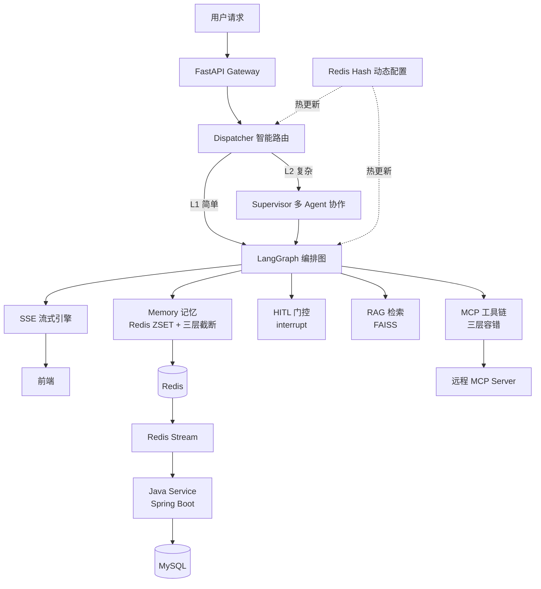

<!-- 作者：lxy -->

# AI 研发助手（Dev Copilot）

> 基于 LangGraph + FastAPI 的多 Agent 协作引擎，支持 OpenSpec 四阶段需求交付、HITL 人机协同审批、CAS 抢占式调度与 MCP 三层容错工具链。

---

## 功能亮点

- **Dispatcher 智能路由** — Flash LLM 结构化输出 + 800ms 超时降级规则兜底，动态选择 L1/L2 模型
- **CAS 抢占式调度** — Redis SETNX + Lua 原子脚本 + 心跳续期（TTL 120s / 心跳 60s），拉模式任务队列
- **记忆三层截断** — Redis ZSET 按时间戳存储，轮次≤10 / 单条≤500字 / 总量≤2000字，防 token 爆炸
- **MCP 三层容错** — L1 并行初始化 / L2 退避重试(5-10-15s) / L3 后台自愈重连，混合工具源
- **多 Agent Supervisor** — LLM-as-Planner 拆解子任务 + SubAgent-as-Tool 委派执行 + 结果整合
- **OpenSpec 四阶段** — proposal → design → tasks → apply，每阶段 HITL 断点等待用户确认
- **HITL 门控** — LangGraph `interrupt()` 原语实现高风险操作审核（write_file / git_commit 等）
- **RAG 知识检索** — FAISS IndexFlatL2 + RecursiveCharacterTextSplitter，top-k 召回 + 距离阈值过滤
- **SSE 流式输出** — `astream_events(v2)` 逐 token 推送，支持 tool/approval/done 多事件类型
- **配置热更新** — Redis Hash + 本地缓存 + 30s 轮询刷新，对标 Diamond 配置中心
- **Java 持久化** — Redis Stream → Spring Boot Consumer Group → MyBatis-Plus saveBatch → MySQL

---

## 架构图



---

## 技术栈

| 层级 | 技术选型 |
|------|----------|
| **Python 引擎** | FastAPI 0.115+ · LangGraph 0.2+ · LangChain-OpenAI · Redis (aioredis) · httpx · Pydantic 2 · FAISS · Loguru |
| **Java 数据服务** | Spring Boot 3.2 · MyBatis-Plus 3.5 · Redis Stream Consumer Group · MySQL 8.0 |
| **基础设施** | Docker Compose · Redis 7 (AOF) · MySQL 8 · SSE · MCP Protocol |
| **LLM** | DeepSeek-Chat (L1 路由/轻量) · DeepSeek-Reasoner (L2 复杂推理) · OpenAI 兼容协议 |

---

## 快速启动

```bash
# 1. 克隆仓库 & 配置环境变量
git clone <repo-url> && cd agent
cp .env.example .env
# 编辑 .env，填入 LLM_API_KEY（DeepSeek / OpenAI 兼容 key）

# 2. 一键启动（Redis + MySQL + Python 引擎 + Java 服务）
docker compose up -d --build

# 3. 访问
# 前端聊天界面：http://localhost:8000
# API 文档：    http://localhost:8000/docs
# Java 数据服务：http://localhost:8081
# 健康检查：    curl http://localhost:8000/health
```

> 本地开发快捷命令：`cd engine && pip install -e . && python -m engine.main`（需本地 Redis）

---

## 开发者模式（中间件 Docker + 代码本地跑）

### 适用场景

日常开发、调试、频繁改代码时推荐此模式：
- 代码改完秒生效（`--reload` 热重载）
- 支持 IDE 断点调试（attach 本地进程）
- 无需每次重新 build 镜像，迭代效率高

### 前置要求

| 依赖 | 版本 | 说明 |
|------|------|------|
| Python | ≥ 3.10（推荐 3.11） | Agent 引擎运行时 |
| Docker & Compose | 最新稳定版 | 仅用于中间件容器 |
| Java 17 | 可选 | 仅 Java 数据服务需要 |

### 步骤

#### 1. 只起中间件

```bash
docker compose up -d redis mysql
```

> 仅启动 Redis 和 MySQL 容器，Python/Java 服务在本地运行。

#### 2. Python 引擎本地启动

```bash
cd engine
python3.11 -m venv .venv && source .venv/bin/activate
pip install -e .
cd ..  # 回到 agent/ 根目录
uvicorn engine.main:app --reload --host 0.0.0.0 --port 8000
```

- `--reload`：文件变更自动重启，开发必备
- 确保 `.env` 中 `REDIS_URL` 指向 `redis://localhost:6379/0`

#### 3. Java 服务本地启动（可选）

```bash
cd java-service
mvn spring-boot:run
```

> 仅在需要数据持久化功能时启动，默认端口 8081。

#### 4. 访问

- 前端聊天界面：http://localhost:8000
- API 文档：http://localhost:8000/docs
- 健康检查：`curl http://localhost:8000/health`

### 两种模式对比

| 维度 | 全 Docker（方案 A） | 开发者模式（方案 B） |
|------|---------------------|----------------------|
| **启动方式** | `docker compose up -d --build` 一键全起 | 中间件容器 + 本地进程分开启动 |
| **代码生效** | 需重新 build 镜像（~30s） | 秒级热重载（`--reload`） |
| **调试支持** | 需额外配置 remote debug | 原生 IDE 断点调试 |
| **环境一致性** | 接近生产环境，适合联调验收 | 依赖本地 Python/Java 版本 |
| **资源占用** | 较高（所有服务容器化） | 较低（仅中间件容器化） |

### 切换提示

两种模式可随时切换：

```bash
# 停掉全部容器（从全 Docker 切到开发者模式）
docker compose down

# 只保留中间件（开发者模式）
docker compose up -d redis mysql

# 恢复全 Docker 模式
docker compose up -d --build
```

---

## 项目结构

```
agent/
├── docker-compose.yml           # 多服务编排（Redis/MySQL/Engine/Java）
├── .env.example                 # 环境变量模板
├── engine/                      # Python Agent 引擎（核心）
│   ├── main.py                  # FastAPI 入口 + lifespan 初始化
│   ├── config/settings.py       # Pydantic Settings 配置管理
│   ├── infra/                   # 基础设施（redis_client / llm_client / dynamic_config）
│   ├── core/
│   │   ├── dispatcher/          # 智能路由（Flash LLM + 超时降级）
│   │   ├── scheduler/           # CAS 抢占锁 + 任务队列
│   │   ├── memory/              # ZSET 记忆 + 三层截断格式化
│   │   ├── mcp/                 # MCP 三层容错 + 混合工具源
│   │   ├── orchestrator/        # Supervisor + Planner + SubAgentTool
│   │   ├── openspec/            # 四阶段工作流（proposal→apply）
│   │   ├── hitl/                # HITL 人机协同中断门控
│   │   ├── rag/                 # FAISS 向量检索 + Retriever
│   │   └── streaming/           # SSE 流式引擎
│   ├── orchestrator/            # LangGraph 编排（graph_builder / nodes）
│   ├── api/                     # REST 路由（chat / tasks / tools）
│   └── tests/                   # 单元测试
├── java-service/                # Java 持久化服务（Spring Boot + MyBatis-Plus）
└── docs/                        # 技术文档
```

---

## 文档索引

| 文档 | 说明 |
|------|------|
| [architecture.md](docs/architecture.md) | 系统架构设计：Mermaid 架构图、模块职责表、数据流、技术选型对比 |
| [interview-guide.md](docs/interview-guide.md) | 面试叙事指南：每个模块的「公司实践 → 个人实现 → 差异认知」三层话术 |
| [interview-qa-deepdive.md](docs/interview-qa-deepdive.md) | 深度学习文档：12 个模块的代码讲解 + 面试问答 + 方案对比 + 八股结合点 |
| [tech-explained.md](docs/tech-explained.md) | 核心技术点详解：底层原理与实现细节补充 |

---

## 环境变量说明

| 变量 | 说明 | 默认值 |
|------|------|--------|
| `LLM_API_KEY` | LLM 服务 API Key（必填） | — |
| `LLM_BASE_URL` | OpenAI 兼容 API 地址 | `https://api.deepseek.com/v1` |
| `LLM_MODEL` | L1 轻量模型 | `deepseek-chat` |
| `LLM_MODEL_L2` | L2 复杂推理模型（留空复用 L1） | — |
| `REDIS_URL` | Redis 连接地址 | `redis://localhost:6379/0` |
| `WORKSPACE_DIR` | Agent 文件操作沙箱目录 | `./workspace` |
| `CONFIG_REFRESH_INTERVAL` | 动态配置轮询间隔(秒) | `30` |

---

## 核心设计理念

1. **渐进式交付** — 不追求一步生成代码，通过四阶段 HITL 断点确保 AI 产出可控、可审、可回退
2. **双栈协作** — Python 专注 AI 编排（异步高性能），Java 专注数据持久化（事务安全、生态成熟）
3. **纵深防御** — 路由超时降级、记忆三层截断、MCP 三层容错、工具调用错误回传 LLM 自主决策
4. **配置驱动** — 模型选择/轮次限制/工具列表均可热更新，无需重启服务

---

## License

MIT

---

> 作者：lxy ｜ 技术栈：Python + Java 双栈 ｜ 编排引擎：LangGraph
